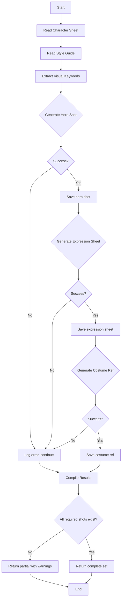

# Character Reference Pattern

## Purpose

Generate a complete set of visual references for a character, ensuring consistency across all images. Uses character sheet data and style guide keywords to build prompts.

## Flow Diagram



## Steps

### Step 1: Read Character Sheet

Extract from `CHARACTER_SHEETS/{name}.md`:
- Physical description
- Age, role
- Color associations
- Costume notes
- Visual reference keywords

### Step 2: Read Style Guide

Extract from style guide or creative brief:
- Global style keywords
- Color palette direction
- Lighting style
- Negative prompts (things to avoid)

### Step 3: Build Prompts

Combine character + style keywords for each shot type:

**Hero Shot Prompt Template:**
```
{character_description}, {age}, {role},
{costume_notes},
{color_associations},
{style_keywords},
{lighting_style},
portrait, character design, concept art
```

**Expression Sheet Prompt Template:**
```
{character_description} expression sheet,
6 expressions: neutral, happy, angry, sad, surprised, determined,
grid layout, white background,
{style_keywords}
```

**Costume Reference Prompt Template:**
```
{character_description} full body costume reference,
front view, {costume_notes},
character design sheet, white background,
{style_keywords}
```

### Step 4: Generate Images

For each shot type:
1. Build the prompt
2. Call image-generation pattern
3. Save to `EXPORTS/character_refs/{character}_{shot_type}.png`

### Step 5: Validate Results

Check that generated images:
- Exist at expected paths
- Are reasonable file sizes (not corrupted)
- Match expected aspect ratios

## Usage Example

### Claude Execution

```
1. Read STORY/CHARACTER_SHEETS/MARS.md
2. Read STORY/CREATIVE_BRIEF.md (visual keywords section)
3. Build hero shot prompt:
   "A 16-year-old girl with dark curly hair and ink-stained hands,
    wearing practical burgundy and teal pirate clothing,
    standing ready to run, guarded expression,
    saturated Caribbean fantasy, jewel-tone palette, golden hour lighting,
    YA adventure aesthetic, portrait, character design"
4. Run: python scripts/generate/fal_generate.py --prompt "..." --output EXPORTS/character_refs/mars_hero.png
5. Repeat for expression sheet and costume ref
```

## Output Structure

```
EXPORTS/character_refs/
├── mars_hero.png
├── mars_expressions.png
├── mars_costume.png
├── jonah_hero.png
├── jonah_expressions.png
└── jonah_costume.png
```

## Notes

- Consistency is hard; include the same core descriptors in every prompt for a character
- Expression sheets work best with simple prompts; don't overload with style keywords
- For live-action YA, avoid "anime" or "cartoon" style keywords
- Always include negative prompts from style guide to avoid unwanted aesthetics
