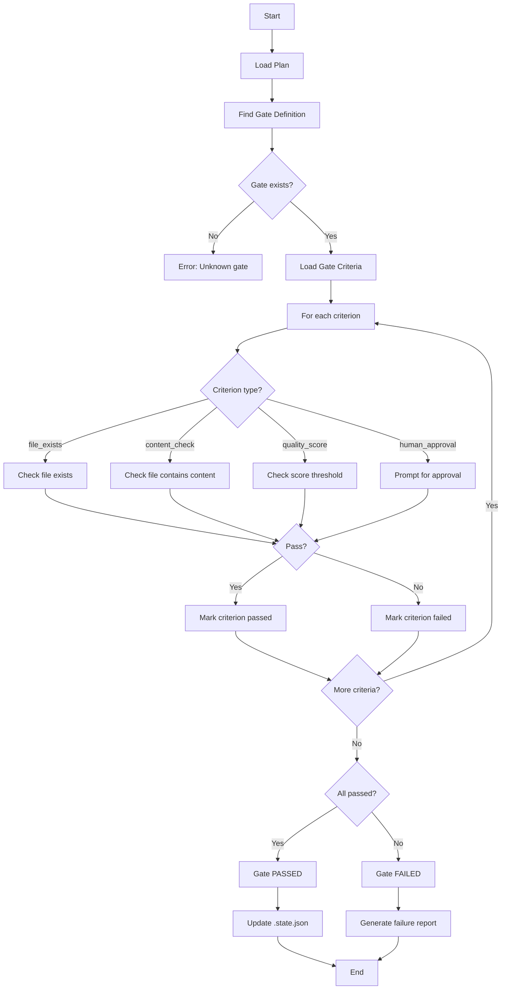
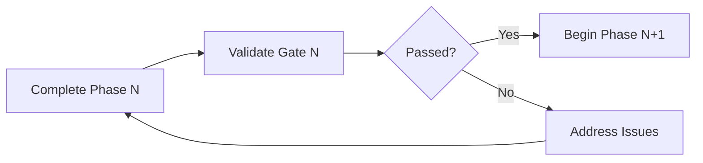

# Gate Validation Pattern

## Purpose

Validate that a production phase has met all its quality gate criteria before proceeding to the next phase. This is the Producer's quality checkpoint.

## Flow Diagram



## Gate Types

### file_exists
Check that a required deliverable exists.

```yaml
- type: file_exists
  path: STORY/CREATIVE_BRIEF.md
```

### content_check
Check that a file contains required content.

```yaml
- type: content_check
  path: STORY/LOGLINE_LOCK.md
  contains: "## Final Logline"
```

### quality_score
Check that a numeric score meets threshold.

```yaml
- type: quality_score
  path: STORY/CRITIQUE_REPORT.md
  field: overall_score
  minimum: 70
```

### human_approval
Require explicit human sign-off.

```yaml
- type: human_approval
  prompt: "Is the style guide approved?"
```

## Validation Process

### Step 1: Load Gate Definition

Read the plan file and find the gate by ID:
```yaml
gates:
  - id: gate-0
    name: Intake Complete
    criteria:
      - CREATIVE_BRIEF.md exists
      - POWER_STACK.md exists
```

### Step 2: Parse Criteria

Convert human-readable criteria to validation rules:
- "X.md exists" → `file_exists` check
- "X contains Y" → `content_check`
- "Score >= N" → `quality_score`
- "Approved by user" → `human_approval`

### Step 3: Execute Checks

For each criterion:
1. Determine check type
2. Execute validation
3. Record result (pass/fail + details)

### Step 4: Report Results

Generate validation report:
```json
{
  "gate": "gate-0",
  "name": "Intake Complete",
  "passed": true,
  "criteria": [
    {
      "description": "CREATIVE_BRIEF.md exists",
      "passed": true,
      "details": "File found at STORY/CREATIVE_BRIEF.md"
    },
    {
      "description": "POWER_STACK.md exists",
      "passed": true,
      "details": "File found at STORY/POWER_STACK.md"
    }
  ],
  "timestamp": "2026-02-03T12:00:00Z"
}
```

### Step 5: Update State

If passed, update `.state.json`:
```json
{
  "gates_passed": ["gate-0"],
  "current_phase": "next-phase"
}
```

## Usage Example

### Claude Execution

```
1. Read PROJECT_CONFIG.yaml to find plan
2. Read PLANS/{plan}/PLAN.md
3. Find gate-1 definition
4. For each criterion:
   - Check if STORY/LOGLINE_LOCK.md exists → PASS
   - Check if CHARACTER_SHEETS/ has files → PASS
   - Check if EPISODE_STRUCTURE.md exists → PASS
5. All passed → Update .state.json, proceed to next phase
```

### Failure Handling

If any criterion fails:
1. Report which criteria failed
2. Explain what's missing
3. Suggest remediation steps
4. Do NOT update state or proceed

## Integration with Producer

The Producer role invokes this pattern at phase boundaries:



## Notes

- Gates are checkpoints, not blockers—the Producer can override with user approval
- Failed gates should explain WHY, not just WHAT failed
- Human approval gates require explicit "yes" from user
- Quality score gates require the score to be computed first (may need another skill)
