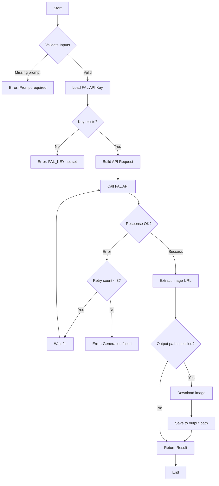

# Image Generation Pattern

## Purpose

Generate images using FAL.ai's API. This is the foundational pattern for all visual asset generation—character references, location shots, storyboards, etc.

## Flow Diagram



## Steps

### Step 1: Validate Inputs

Check that required inputs are present and valid:
- `prompt` must be non-empty string
- `aspect_ratio` must be one of allowed values
- `output_path` directory must exist (if specified)

### Step 2: Load API Key

Read `FAL_KEY` from environment or `.env` file:
```bash
# In .env
FAL_KEY=your-api-key-here
```

### Step 3: Build API Request

Construct the FAL API request:
```json
{
  "prompt": "...",
  "image_size": {
    "width": 1024,
    "height": 1536
  },
  "num_images": 1,
  "output_format": "png"
}
```

Aspect ratio to dimensions mapping:
| Ratio | Width | Height |
|-------|-------|--------|
| 1:1   | 1024  | 1024   |
| 2:3   | 1024  | 1536   |
| 3:2   | 1536  | 1024   |
| 16:9  | 1920  | 1080   |
| 9:16  | 1080  | 1920   |

### Step 4: Call FAL API

POST to `https://fal.run/{model}` with authorization header.

Expected response:
```json
{
  "images": [
    {"url": "https://..."}
  ]
}
```

### Step 5: Download and Save

If `output_path` specified:
1. Download image from URL
2. Save to specified path
3. Return local path

## Usage Examples

### Via Script

```bash
python scripts/generate/fal_generate.py \
  --prompt "A young woman with dark curly hair, standing on a ship deck, saturated Caribbean colors" \
  --aspect-ratio 2:3 \
  --output EXPORTS/character_refs/mars_hero.png
```

### Via Claude

```
Read the character sheet for Mars, extract visual keywords,
then call the fal_generate.py script with appropriate prompt.
```

## Notes

- FAL API has rate limits; respect retry delays
- Generated images are temporary on FAL servers; always download if you need to keep them
- For consistent character appearance, include style keywords in every prompt
- The model `fal-ai/fast-sdxl` is recommended for speed; use `fal-ai/flux/dev` for higher quality
