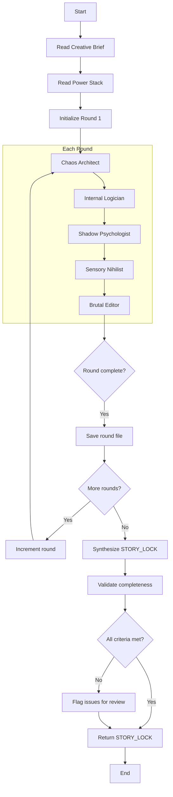
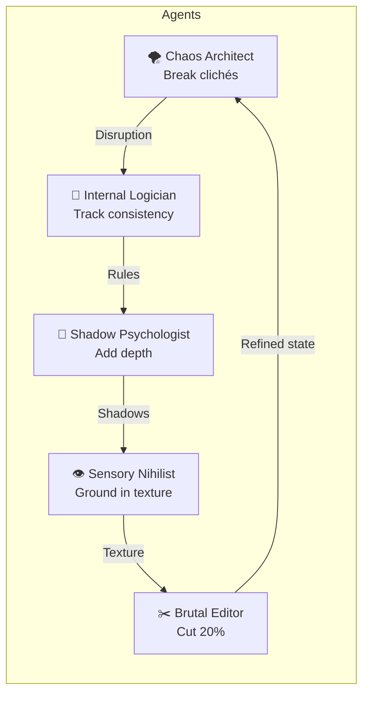

# Writers Room Pattern

## Purpose

Generate original, non-cliché stories through structured creative friction. Five specialized agents challenge each other's contributions across multiple rounds, preventing "AI Average" output.

## Flow Diagram



## The 5 Agents



### Agent Roles

| Agent | Mission | Constraint |
|-------|---------|------------|
| **Chaos Architect** | Break clichés, introduce Black Swan events | No happy mid-story endings; must end on difficult choice |
| **Internal Logician** | Track world rules, punish violations | Cannot fix errors; must add consequences instead |
| **Shadow Psychologist** | Add hidden desires, fatal flaws | Every character must sabotage the mission |
| **Sensory Nihilist** | Ground in visceral detail | Forbidden: abstract emotions (sad, angry, scared) |
| **Brutal Editor** | Cut 20%, enforce structure | Must maintain structural constraint |

## Round Sequence

### Round 1: Genesis
- Establish bizarre premise
- Define world rules
- Create character shadows
- Ground in sensory reality
- Establish structural constraint

### Round 2: Complication
- Introduce Black Swan event
- Show consequences of actions
- Reveal how flaws sabotage characters
- Deepen texture and physical toll
- Cut redundancy

### Round 3: Refinement
- Final twist that recontextualizes everything
- Lock all rules as consistent
- Complete (not resolve) character arcs
- Final sensory polish
- Produce STORY_LOCK synthesis

## Output Format

### Per-Round Document

```markdown
# Writers Room - Round {N}

## Round Summary
{What this round accomplished}

## 1. Chaos Architect
### Contribution
{The disruption}
### Rationale
{Why this breaks expectations}

## 2. Internal Logician
### World Rules Added
{Bullet list}
### Consequences Applied
{Punishments for broken rules}

## 3. Shadow Psychologist
### Character Shadows
| Character | Fatal Flaw | Hidden Desire | Wound |
|-----------|------------|---------------|-------|

## 4. Sensory Nihilist
### Sensory Grounding
{Rewritten passages}

## 5. Brutal Editor
### Cuts Made
{What was removed}
### Final State
{Summary for next round}
```

### STORY_LOCK Format

```markdown
# Story Lock

## Final Premise
{One paragraph}

## Logline
{Single sentence}

## World Rules (Locked)
{Final list}

## Character Shadows (Locked)
{Final table}

## Structural Constraint
{The rule}

## Key Scenes
{Essential scenes}

## Sensory Signature
{Dominant textures}
```

## Execution Notes

This pattern is executed manually by Claude, role-playing each agent in sequence. The key is maintaining creative tension between agents:

- **Chaos Architect** should make the **Logician** work hard
- **Logician** should constrain **Psychologist's** character additions
- **Psychologist** should complicate **Nihilist's** sensory work
- **Nihilist** should make **Editor** want to cut differently
- **Editor** should force **Chaos Architect** to be more precise next round

## Quality Criteria

- No "AI Average" — if it sounds generic, Chaos Architect failed
- No floating heads — if we can't smell the scene, Nihilist failed
- No plot holes — if rules are broken without consequence, Logician failed
- No cardboard characters — if anyone is purely good/evil, Psychologist failed
- No bloat — if pacing drags, Editor failed
